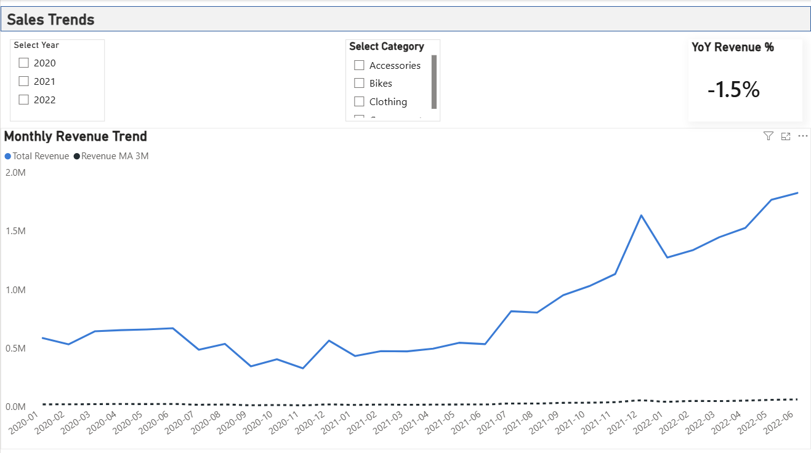

# Retail Sales Analytics Dashboard

An end-to-end data analytics project using **SQL, PostgreSQL, DAX, and Power BI**.

This project simulates the work of a junior data analyst at a retail company:  
you design the schema, load raw CSV files into PostgreSQL, build views, create DAX measures, and deliver interactive dashboards in Power BI.


---

## 📌 Project Overview  
This project analyzes retail sales performance across multiple years.  
The goal was to build a complete, end-to-end analytics workflow including:

- SQL-based data cleaning & transformation  
- Data modeling in PostgreSQL  
- Calculation of key KPIs using DAX  
- Interactive Power BI dashboards for insights & decision-making  

---

## 📌 Business Questions Answered

This project was designed to answer key business questions for a retail company.

### **1. Sales Performance**
- What is the total revenue for each year?
- Which categories contribute the most to sales?
- What are the sales trends over time (monthly, quarterly, yearly)?
- Which products generate the highest revenue and profit?

### **2. Customer Insights**
- How do different customer segments (gender, income, etc.) contribute to revenue?
- Which customer groups purchase the highest-margin products?

### **3. Product Performance**
- Which products have the highest gross profit?
- What are the top-performing products by revenue?
- Which categories and subcategories consistently perform well?

### **4. Returns Analysis**
- What is the return rate (%) by product category?
- Which products have high return rates and low profitability?
- Are certain territories linked to higher return volume?

### **5. Time Intelligence Analysis**
- How does monthly revenue change over time?
- What is the 3-month moving average trend?
- What is the year-over-year (YoY) revenue growth?

---

## 🛠 Tools & Technologies  
- **SQL (PostgreSQL)** – for data cleaning, joining, calculations  
- **Power BI** – for data modeling, DAX measures, visualization  
- **DAX** – custom KPI calculations  
- **GitHub** – version control & project documentation  

---

## 📊 Dashboards Included  
### **1️⃣ Executive Summary**
- Total Revenue  
- Gross Profit  
- Profit Margin %  
- Revenue Trend Over Time  
- Revenue by Category  

### **2️⃣ Sales Trends Page**
- Monthly Revenue Trend  
- 3-Month Moving Average  
- YoY Revenue Change (%)  
- Year & Category slicers  

### **3️⃣ Product Insights Page**
- Top 10 Products by Revenue  
- Top 10 Products by Gross Profit  
- Detailed product table  
- Category / Subcategory slicers  

### **4️⃣ Returns Analysis Page**
- Return Rate % (KPI)  
- Return Rate by Category  
- Profitability vs Return Rate (Scatter Plot)  
- Return Details Table  

---

## 🧮 Key DAX Measures  
```DAX
Total Revenue = SUM(public_vw_sales.revenue)

Total Gross Profit = SUM(public_vw_sales.gross_profit)

Profit Margin % =
DIVIDE([Total Gross Profit], [Total Revenue])

YoY Revenue % =
VAR CurrentYear = SELECTEDVALUE(public_vw_sales.year_)
VAR PrevYear = CurrentYear - 1
VAR CurrRevenue =
    CALCULATE([Total Revenue], public_vw_sales.year_ = CurrentYear)
VAR PrevRevenue =
    CALCULATE([Total Revenue], public_vw_sales.year_ = PrevYear)
RETURN
DIVIDE(CurrRevenue - PrevRevenue, PrevRevenue)

```

---

## 📸 Dashboard Screenshots  
Here are the key pages from the Power BI dashboard included in this project.

---

### 📊 1️⃣ Executive Summary
High-level KPIs and overview of revenue, profitability, and customer trends.


---

### 📈 2️⃣ Sales Trends
Monthly + yearly revenue trends, moving averages, and YoY analysis.



---

### 🛒 3️⃣ Product Insights
Top products by revenue, gross profit, and category performance.


---

### 🔄 4️⃣ Returns Analysis
Return rate performance and profitability vs return rate.


---

